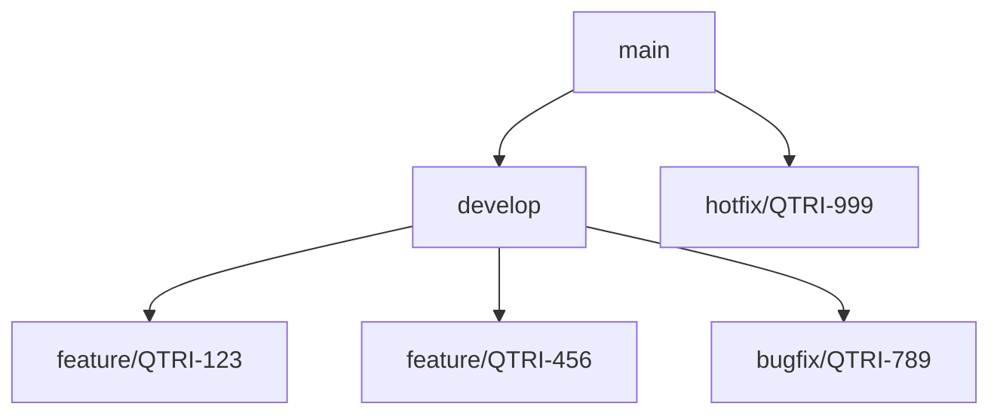
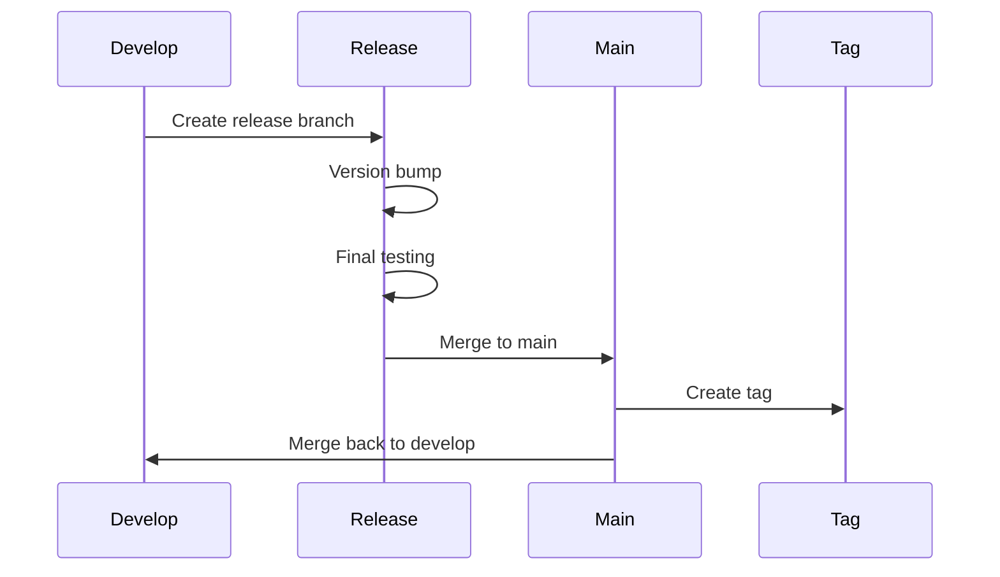

# Git Workflow Standards

## Branch Strategy

### Branch Naming Convention

```
<type>/<ticket-number>-<short-description>
```

Types:
- `feature`: New features
- `bugfix`: Bug fixes
- `hotfix`: Critical fixes for production
- `refactor`: Code refactoring
- `docs`: Documentation updates
- `test`: Test additions or modifications
- `chore`: Maintenance tasks

Examples:
```bash
feature/QTRI-123-add-user-authentication
bugfix/QTRI-456-fix-login-validation
refactor/QTRI-789-optimize-database-queries
```

### Branch Hierarchy



## Commit Standards

### Commit Message Format

```
<type>(<scope>): <subject>

<body>

<footer>
```

Types:
- `feat`: New feature
- `fix`: Bug fix
- `docs`: Documentation changes
- `style`: Code style changes (formatting, etc.)
- `refactor`: Code refactoring
- `test`: Adding or modifying tests
- `chore`: Maintenance tasks

Example:
```bash
feat(auth): implement JWT authentication

- Add JWT token generation
- Implement token validation middleware
- Add refresh token functionality

Closes QTRI-123
```

### Commit Best Practices

1. **Atomic Commits**
   ```bash
   # ✅ Good: Single logical change
   git commit -m "feat(user): add email validation"

   # ❌ Bad: Multiple unrelated changes
   git commit -m "add email validation, fix button style, update docs"
   ```

2. **Clear Messages**
   ```bash
   # ✅ Good: Clear and descriptive
   git commit -m "fix(auth): handle expired JWT tokens"

   # ❌ Bad: Vague and unclear
   git commit -m "fix auth bug"
   ```

## Pull Request Process

### PR Template

```markdown
## Description
Brief description of the changes

## Type of Change
- [ ] Bug fix
- [ ] New feature
- [ ] Breaking change
- [ ] Documentation update

## How Has This Been Tested?
Describe the tests you ran

## Checklist
- [ ] My code follows the project's style guidelines
- [ ] I have performed a self-review
- [ ] I have added tests that prove my fix/feature works
- [ ] New and existing unit tests pass locally
- [ ] I have updated the documentation
- [ ] My changes generate no new warnings
```

### Review Process

1. **Code Review Checklist**
   - Code follows project standards
   - Tests are included and passing
   - Documentation is updated
   - No unnecessary changes
   - Performance considerations addressed

2. **Review Comments**
   ```bash
   # ✅ Good: Specific and constructive
   "Consider using a guard clause here to reduce nesting"

   # ❌ Bad: Vague or unhelpful
   "This could be better"
   ```

## Release Process

### Version Numbering

Follow Semantic Versioning (SemVer):
```
MAJOR.MINOR.PATCH
```

Example:
```bash
1.0.0   # Initial release
1.1.0   # New feature added
1.1.1   # Bug fix
2.0.0   # Breaking change
```

### Release Workflow



### Release Checklist

1. **Pre-release**
   ```bash
   # Update version
   npm version minor

   # Update changelog
   git log --pretty=format:"- %s" > CHANGELOG.md

   # Run tests
   npm run test
   ```

2. **Release**
   ```bash
   # Create release branch
   git checkout -b release/1.1.0

   # Create tag
   git tag -a v1.1.0 -m "Version 1.1.0"

   # Push to remote
   git push origin v1.1.0
   ```

## Git Hooks

### Pre-commit Hook

```bash
#!/bin/sh
# .git/hooks/pre-commit

# Run linter
npm run lint

# Run tests
npm run test

# Check TypeScript
npm run type-check
```

### Pre-push Hook

```bash
#!/bin/sh
# .git/hooks/pre-push

# Run full test suite
npm run test:full

# Build project
npm run build
```

## Conflict Resolution

### Handling Merge Conflicts

1. **Update Branches**
   ```bash
   git checkout develop
   git pull origin develop
   git checkout feature/QTRI-123
   git merge develop
   ```

2. **Resolve Conflicts**
   ```bash
   # After fixing conflicts
   git add .
   git commit -m "resolve: merge conflicts with develop"
   ```

### Rebase vs Merge

```bash
# Rebase feature branch
git checkout feature/QTRI-123
git rebase develop

# Merge feature branch
git checkout develop
git merge feature/QTRI-123
```

## Git Best Practices

### 1. Keep Branches Updated
```bash
# Update branch with latest changes
git checkout feature/QTRI-123
git fetch origin
git rebase origin/develop
```

### 2. Clean Up Local Branches
```bash
# Delete merged branches
git branch --merged | grep -v "\*" | xargs -n 1 git branch -d

# Prune remote branches
git remote prune origin
```

### 3. Use Git Aliases
```bash
# Add to .gitconfig
[alias]
    st = status
    co = checkout
    br = branch
    ci = commit
    unstage = reset HEAD --
    last = log -1 HEAD
```

### 4. Protect Sensitive Data
```bash
# Add to .gitignore
.env
*.key
credentials.json
``` 