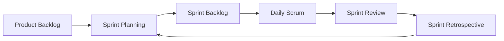
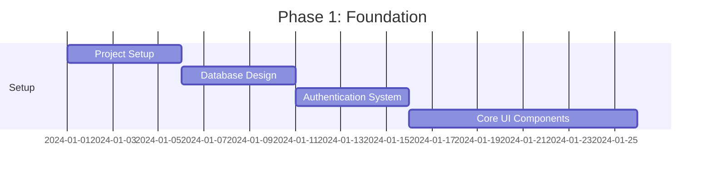
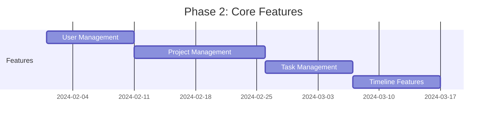
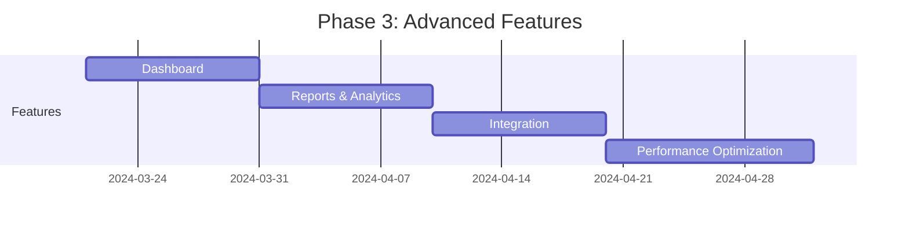

# Project Management Guidelines

## Table of Contents
- [Agile Process](#agile-process)
- [Project Timeline](#project-timeline)
- [Cost Estimation](#cost-estimation)
- [Page Requirements](#page-requirements)
- [Sprint Planning](#sprint-planning)
- [Quality Assurance](#quality-assurance)

## Agile Process

### Scrum Framework



### Sprint Structure
- Sprint Duration: 2 weeks
- Story Points: Fibonacci sequence (1, 2, 3, 5, 8, 13, 21)
- Velocity: Measured per sprint

### Ceremonies
1. **Sprint Planning** (4 hours)
   - Backlog grooming
   - Story point estimation
   - Sprint goal definition

2. **Daily Standup** (15 minutes)
   - What was completed?
   - What's planned for today?
   - Any blockers?

3. **Sprint Review** (2 hours)
   - Demo completed features
   - Stakeholder feedback
   - Acceptance criteria verification

4. **Sprint Retrospective** (1.5 hours)
   - What went well?
   - What could be improved?
   - Action items for next sprint

## Project Timeline

### Phase 1: Foundation (4 weeks)


### Phase 2: Core Features (8 weeks)


### Phase 3: Advanced Features (6 weeks)


## Cost Estimation

### Development Costs

| Component | Hours | Rate (USD/hr) | Cost (USD) |
|-----------|-------|---------------|------------|
| Frontend Development | 480 | 50 | 24,000 |
| Backend Development | 400 | 60 | 24,000 |
| Database Design | 80 | 60 | 4,800 |
| UI/UX Design | 120 | 45 | 5,400 |
| Testing | 160 | 40 | 6,400 |
| DevOps | 80 | 55 | 4,400 |
| **Total** | **1320** | - | **69,000** |

### Infrastructure Costs (Monthly)

| Service | Cost (USD) |
|---------|------------|
| Cloud Hosting (AWS) | 300 |
| Database (RDS) | 100 |
| CDN | 50 |
| Monitoring Tools | 100 |
| **Total Monthly** | **550** |

### Additional Costs

| Item | Cost (USD) |
|------|------------|
| SSL Certificates | 100/year |
| Domain Name | 20/year |
| Third-party Services | 200/month |
| **Total Annual** | **2,740** |

## Page Requirements

### Authentication Pages

#### Login Page
- **Complexity**: Medium
- **Estimated Time**: 3 days
- **Requirements**:
  ```typescript
  interface LoginPage {
    features: {
      emailLogin: boolean;
      socialLogin: boolean;
      forgotPassword: boolean;
      rememberMe: boolean;
    };
    validation: {
      email: RegExp;
      password: {
        minLength: number;
        requireSpecialChar: boolean;
      };
    };
    security: {
      rateLimit: number;
      maxAttempts: number;
      lockoutPeriod: number;
    };
  }
  ```

#### User Registration
- **Complexity**: Medium
- **Estimated Time**: 4 days
- **Requirements**:
  ```typescript
  interface Registration {
    userFields: {
      required: ['email', 'password', 'name'];
      optional: ['phone', 'organization'];
    };
    validation: {
      email: RegExp;
      password: {
        minLength: 8;
        requirements: ['uppercase', 'number', 'special'];
      };
    };
    features: {
      emailVerification: boolean;
      termsAcceptance: boolean;
    };
  }
  ```

### Dashboard

#### Main Dashboard
- **Complexity**: High
- **Estimated Time**: 8 days
- **Requirements**:
  ```typescript
  interface Dashboard {
    widgets: {
      projectSummary: boolean;
      taskOverview: boolean;
      timeline: boolean;
      notifications: boolean;
    };
    features: {
      customization: boolean;
      dataExport: boolean;
      realTimeUpdates: boolean;
    };
    charts: {
      projectProgress: boolean;
      taskDistribution: boolean;
      teamWorkload: boolean;
    };
  }
  ```

### Project Management

#### Project List
- **Complexity**: Medium
- **Estimated Time**: 5 days
- **Requirements**:
  ```typescript
  interface ProjectList {
    views: {
      grid: boolean;
      list: boolean;
      kanban: boolean;
    };
    features: {
      search: boolean;
      filter: boolean;
      sort: boolean;
      bulkActions: boolean;
    };
    pagination: {
      itemsPerPage: number;
      infiniteScroll: boolean;
    };
  }
  ```

#### Project Details
- **Complexity**: High
- **Estimated Time**: 10 days
- **Requirements**:
  ```typescript
  interface ProjectDetails {
    sections: {
      overview: boolean;
      tasks: boolean;
      timeline: boolean;
      team: boolean;
      documents: boolean;
    };
    features: {
      taskManagement: boolean;
      timeTracking: boolean;
      fileAttachments: boolean;
      comments: boolean;
    };
    permissions: {
      roles: ['admin', 'manager', 'member', 'viewer'];
      customRoles: boolean;
    };
  }
  ```

### Task Management

#### Task Board
- **Complexity**: High
- **Estimated Time**: 7 days
- **Requirements**:
  ```typescript
  interface TaskBoard {
    views: {
      kanban: boolean;
      list: boolean;
      calendar: boolean;
    };
    features: {
      dragAndDrop: boolean;
      quickEdit: boolean;
      filters: boolean;
      labels: boolean;
    };
    integration: {
      notifications: boolean;
      calendar: boolean;
    };
  }
  ```

## Sprint Planning

### Sprint 1: Foundation
- **Duration**: 2 weeks
- **Story Points**: 34
- **Focus**: Project setup and core infrastructure

```typescript
interface Sprint1 {
  goals: [
    'Setup development environment',
    'Implement authentication system',
    'Create base UI components'
  ];
  deliverables: {
    technical: [
      'Project repository',
      'CI/CD pipeline',
      'Authentication API'
    ];
    business: [
      'Login page',
      'Registration page',
      'Password recovery'
    ];
  };
}
```

### Sprint 2: Core Features
- **Duration**: 2 weeks
- **Story Points**: 40
- **Focus**: Basic project management features

```typescript
interface Sprint2 {
  goals: [
    'Implement project CRUD',
    'Create task management',
    'Setup dashboard'
  ];
  deliverables: {
    technical: [
      'Project API',
      'Task API',
      'Dashboard components'
    ];
    business: [
      'Project list view',
      'Project details page',
      'Basic dashboard'
    ];
  };
}
```

## Quality Assurance

### Testing Requirements

```typescript
interface QARequirements {
  unitTesting: {
    coverage: '80%';
    tools: ['Jest', 'React Testing Library'];
  };
  integrationTesting: {
    coverage: '70%';
    tools: ['Cypress'];
  };
  e2eTesting: {
    criticalPaths: [
      'User authentication',
      'Project creation',
      'Task management'
    ];
  };
  performance: {
    metrics: {
      pageLoad: '< 3s';
      firstContentfulPaint: '< 1.5s';
      timeToInteractive: '< 4s';
    };
  };
}
```

### Acceptance Criteria

```typescript
interface AcceptanceCriteria {
  functional: {
    authentication: [
      'User can login with email',
      'User can register new account',
      'Password recovery works'
    ];
    projectManagement: [
      'Create new projects',
      'Assign team members',
      'Track progress'
    ];
    taskManagement: [
      'Create and assign tasks',
      'Update task status',
      'Comment on tasks'
    ];
  };
  nonFunctional: {
    performance: [
      'Page load under 3 seconds',
      'Smooth animations',
      'Responsive design'
    ];
    security: [
      'Data encryption',
      'Input validation',
      'XSS prevention'
    ];
    usability: [
      'Intuitive navigation',
      'Helpful error messages',
      'Consistent UI'
    ];
  };
}
``` 