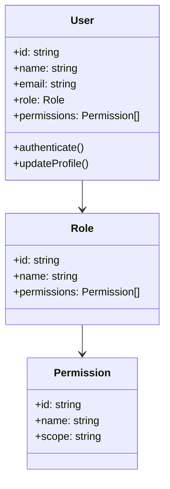
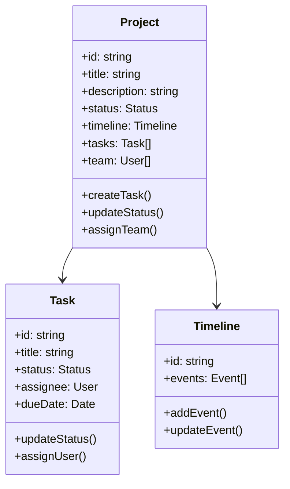
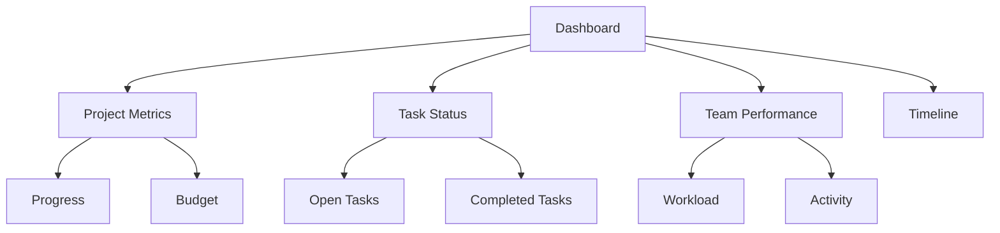

# Requirements Specification

## System Overview

### Purpose
The QTRI Management System is designed to provide a comprehensive project and research management platform for quantum technology research initiatives.

### Target Users
1. Research Teams
2. Project Managers
3. Administrators
4. Stakeholders
5. External Collaborators

## Functional Requirements

### 1. User Management



#### 1.1 Authentication
```typescript
interface AuthenticationRequirements {
  methods: {
    email: {
      required: true;
      validation: RegExp;
    };
    sso: {
      providers: ['Google', 'Microsoft'];
      required: false;
    };
    mfa: {
      required: false;
      methods: ['authenticator', 'sms'];
    };
  };
  security: {
    passwordPolicy: {
      minLength: 8;
      requireUppercase: true;
      requireNumber: true;
      requireSpecial: true;
    };
    sessionManagement: {
      timeout: number; // minutes
      maxConcurrentSessions: number;
    };
  };
}
```

#### 1.2 Authorization
```typescript
interface AuthorizationRequirements {
  roles: {
    admin: {
      permissions: 'all';
    };
    manager: {
      permissions: [
        'create_project',
        'assign_users',
        'view_reports'
      ];
    };
    researcher: {
      permissions: [
        'view_project',
        'create_task',
        'update_task'
      ];
    };
    viewer: {
      permissions: [
        'view_project',
        'view_task'
      ];
    };
  };
  customRoles: {
    enabled: true;
    maxCustomRoles: 10;
  };
}
```

### 2. Project Management



#### 2.1 Project Creation
```typescript
interface ProjectCreationRequirements {
  basicInfo: {
    required: [
      'title',
      'description',
      'startDate',
      'endDate'
    ];
    optional: [
      'budget',
      'priority',
      'tags'
    ];
  };
  team: {
    roles: [
      'project_manager',
      'team_member',
      'stakeholder'
    ];
    maxMembers: number;
  };
  documentation: {
    templates: boolean;
    attachments: {
      maxSize: number; // MB
      allowedTypes: string[];
    };
  };
}
```

#### 2.2 Task Management
```typescript
interface TaskManagementRequirements {
  taskTypes: [
    'feature',
    'bug',
    'research',
    'documentation'
  ];
  priorityLevels: [
    'critical',
    'high',
    'medium',
    'low'
  ];
  tracking: {
    timeTracking: boolean;
    dependencies: boolean;
    subtasks: boolean;
  };
  collaboration: {
    comments: boolean;
    attachments: boolean;
    mentions: boolean;
  };
}
```

### 3. Dashboard Requirements



#### 3.1 Metrics and Analytics
```typescript
interface AnalyticsRequirements {
  projectMetrics: {
    progressTracking: boolean;
    budgetTracking: boolean;
    timelineAnalysis: boolean;
  };
  taskMetrics: {
    completionRate: boolean;
    timeToComplete: boolean;
    blockersAnalysis: boolean;
  };
  teamMetrics: {
    workloadDistribution: boolean;
    performanceTracking: boolean;
    collaborationAnalysis: boolean;
  };
  reporting: {
    customReports: boolean;
    exportFormats: ['pdf', 'excel', 'csv'];
    scheduledReports: boolean;
  };
}
```

### 4. Integration Requirements

#### 4.1 External Systems
```typescript
interface IntegrationRequirements {
  versionControl: {
    providers: ['GitHub', 'GitLab', 'Bitbucket'];
    features: [
      'commit_tracking',
      'pr_integration',
      'issue_sync'
    ];
  };
  communication: {
    platforms: ['Slack', 'Microsoft Teams'];
    notifications: {
      projectUpdates: boolean;
      taskAssignments: boolean;
      mentions: boolean;
    };
  };
  storage: {
    providers: ['Google Drive', 'Dropbox', 'OneDrive'];
    features: [
      'file_sync',
      'version_control',
      'sharing'
    ];
  };
}
```

## Non-Functional Requirements

### 1. Performance

```typescript
interface PerformanceRequirements {
  response: {
    pageLoad: '< 3 seconds';
    apiResponse: '< 500ms';
    searchResults: '< 1 second';
  };
  scalability: {
    concurrent_users: 1000;
    data_storage: '1TB';
    file_storage: '5TB';
  };
  availability: {
    uptime: '99.9%';
    backup: {
      frequency: 'daily';
      retention: '30 days';
    };
  };
}
```

### 2. Security

```typescript
interface SecurityRequirements {
  dataProtection: {
    encryption: {
      atRest: true;
      inTransit: true;
      algorithm: 'AES-256';
    };
    access: {
      rbac: true;
      mfa: true;
      ipRestriction: boolean;
    };
  };
  compliance: {
    gdpr: boolean;
    hipaa: boolean;
    iso27001: boolean;
  };
  audit: {
    logging: boolean;
    userActions: boolean;
    systemEvents: boolean;
  };
}
```

### 3. Usability

```typescript
interface UsabilityRequirements {
  accessibility: {
    wcag: 'AA';
    screenReader: boolean;
    keyboard: boolean;
  };
  responsiveness: {
    desktop: boolean;
    tablet: boolean;
    mobile: boolean;
  };
  localization: {
    languages: ['en', 'th'];
    dateFormats: boolean;
    numberFormats: boolean;
  };
}
```

## Technical Requirements

### 1. Frontend

```typescript
interface FrontendRequirements {
  framework: 'Next.js 14';
  styling: {
    framework: 'Tailwind CSS';
    theming: boolean;
    darkMode: boolean;
  };
  stateManagement: {
    global: 'React Context';
    local: 'React Hooks';
    cache: 'React Query';
  };
  performance: {
    codeSpitting: boolean;
    lazyLoading: boolean;
    imageOptimization: boolean;
  };
}
```

### 2. Backend

```typescript
interface BackendRequirements {
  api: {
    type: 'REST';
    versioning: boolean;
    documentation: 'OpenAPI';
  };
  database: {
    primary: 'PostgreSQL';
    caching: 'Redis';
    migrations: boolean;
  };
  security: {
    authentication: 'JWT';
    rateLimit: boolean;
    cors: boolean;
  };
}
```

### 3. DevOps

```typescript
interface DevOpsRequirements {
  ci_cd: {
    platform: 'GitHub Actions';
    automation: [
      'build',
      'test',
      'deploy'
    ];
  };
  monitoring: {
    services: [
      'error_tracking',
      'performance_monitoring',
      'user_analytics'
    ];
    alerts: boolean;
  };
  deployment: {
    containerization: 'Docker';
    orchestration: 'Kubernetes';
    environments: [
      'development',
      'staging',
      'production'
    ];
  };
}
``` 