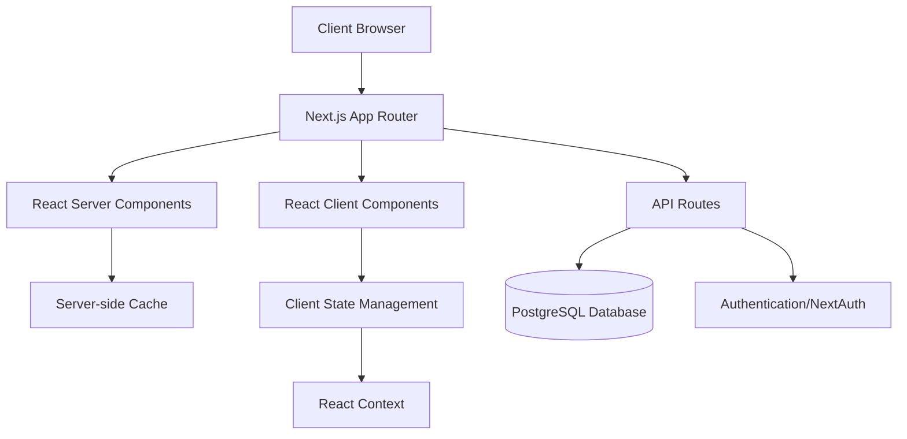
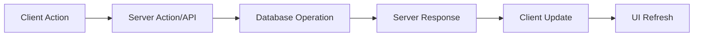
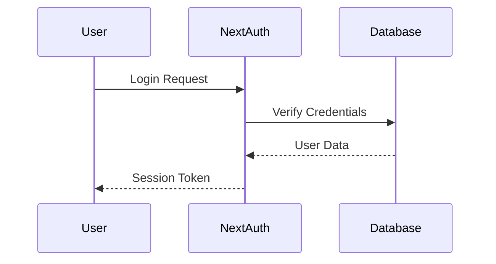

# System Architecture Documentation

## High-Level Architecture

The QTRI Management System follows a modern web application architecture based on Next.js 14 with the following key architectural patterns:

1. **App Router Architecture**
2. **Server Components First**
3. **API Routes for Backend Logic**
4. **PostgreSQL Database Layer**

### Architecture Diagram



## Core Architectural Principles

### 1. Server-First Approach
- Leverages Next.js 14's server components for improved performance
- Reduces client-side JavaScript bundle size
- Enables direct database queries from server components

### 2. Component Architecture
- Atomic Design Pattern
- Composition over inheritance
- Smart and Presentational component separation

### 3. State Management
- React Context for global state
- Server state management with React Query
- Local component state with useState/useReducer

### 4. Data Flow


## Directory Structure Explanation

```
qtri-managements/
├── app/                    # Next.js app directory (main application code)
│   ├── components/        # Shared UI components
│   │   ├── ui/           # Base UI components
│   │   ├── forms/        # Form components
│   │   └── layouts/      # Layout components
│   ├── contexts/         # React context providers
│   ├── dashboard/        # Dashboard module
│   ├── projects/         # Project management
│   ├── hr-management/    # HR management
│   └── ...              # Other modules
├── lib/                  # Shared utilities and helpers
│   ├── utils/           # Utility functions
│   ├── hooks/           # Custom React hooks
│   └── api/             # API utilities
├── public/              # Static assets
└── types/               # TypeScript type definitions
```

## Module Dependencies

### Core Dependencies
1. **Next.js 14**: Framework foundation
2. **React 18**: UI library
3. **TypeScript**: Type system
4. **Tailwind CSS**: Styling
5. **PostgreSQL**: Database

### UI Dependencies
1. **Radix UI**: Accessible components
2. **Headless UI**: Unstyled components
3. **Chart.js**: Data visualization
4. **GridStack**: Dashboard layouts
5. **React Flow**: Workflow diagrams

## Performance Considerations

### Server-Side Optimization
1. **Edge Runtime Support**
   - API routes optimization
   - CDN caching
   - Edge functions

2. **Database Optimization**
   - Connection pooling
   - Query optimization
   - Indexing strategy

### Client-Side Optimization
1. **Code Splitting**
   - Dynamic imports
   - Route-based splitting
   - Component lazy loading

2. **Asset Optimization**
   - Image optimization
   - Font loading strategy
   - CSS optimization

## Security Architecture

### Authentication Flow


### Security Measures
1. **Authentication**: NextAuth.js implementation
2. **Authorization**: Role-based access control
3. **Data Protection**: Input validation and sanitization
4. **API Security**: Rate limiting and CORS 