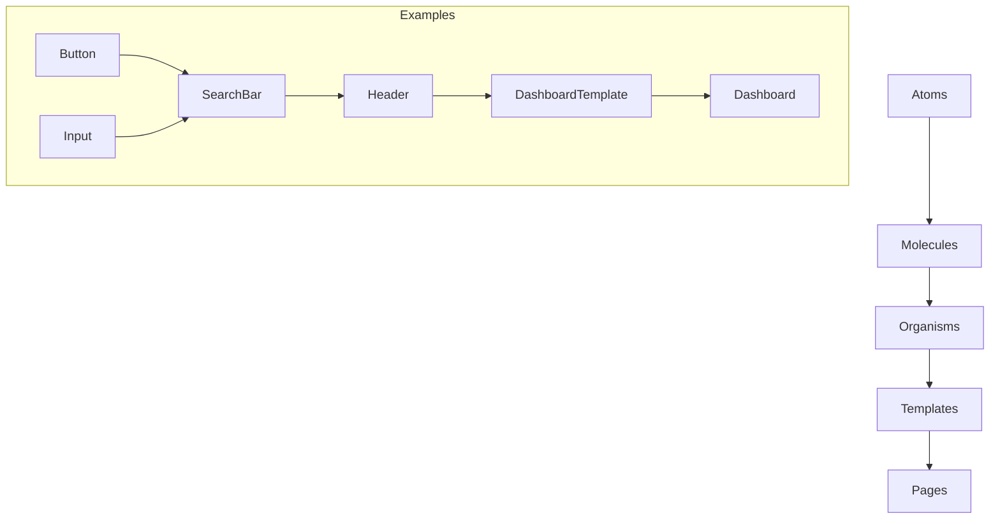

# Component Architecture

## Component Design Philosophy

The QTRI Management System follows the Atomic Design methodology, organizing components in a hierarchical structure from atoms to pages.

### Component Hierarchy



## Component Categories

### 1. Atomic Components (atoms/)
Basic building blocks that cannot be broken down further.

```typescript
// Example: Button Component
interface ButtonProps {
  variant: 'primary' | 'secondary' | 'outline';
  size: 'sm' | 'md' | 'lg';
  children: React.ReactNode;
  onClick?: () => void;
}

const Button: React.FC<ButtonProps> = ({
  variant,
  size,
  children,
  onClick
}) => {
  // Implementation
};
```

### 2. Molecular Components (molecules/)
Simple combinations of atomic components.

```typescript
// Example: SearchBar Component
interface SearchBarProps {
  onSearch: (term: string) => void;
  placeholder?: string;
}

const SearchBar: React.FC<SearchBarProps> = ({
  onSearch,
  placeholder
}) => {
  // Implementation combining Input and Button
};
```

### 3. Organism Components (organisms/)
Complex UI components that form distinct sections of an interface.

```typescript
// Example: DataTable Component
interface DataTableProps<T> {
  data: T[];
  columns: Column[];
  sorting?: SortingConfig;
  pagination?: PaginationConfig;
}

const DataTable = <T extends object>({
  data,
  columns,
  sorting,
  pagination
}: DataTableProps<T>) => {
  // Implementation
};
```

## Component Patterns

### 1. Compound Components
Used for complex, related component groups:

```typescript
// Example: Form Component
const Form = {
  Root: FormRoot,
  Field: FormField,
  Label: FormLabel,
  Input: FormInput,
  Error: FormError,
};

// Usage
<Form.Root>
  <Form.Field>
    <Form.Label>Name</Form.Label>
    <Form.Input />
    <Form.Error />
  </Form.Field>
</Form.Root>
```

### 2. Render Props Pattern
For flexible component rendering:

```typescript
interface DataFetcherProps<T> {
  url: string;
  children: (data: T, loading: boolean) => React.ReactNode;
}

const DataFetcher = <T extends object>({
  url,
  children
}: DataFetcherProps<T>) => {
  // Implementation
};
```

### 3. HOC Pattern
For component enhancement:

```typescript
const withAuth = <P extends object>(
  Component: React.ComponentType<P>
) => {
  return (props: P) => {
    // Authentication logic
    return <Component {...props} />;
  };
};
```

## State Management in Components

### 1. Local State
```typescript
const [state, setState] = useState<State>(initialState);
```

### 2. Context State
```typescript
const GlobalStateContext = createContext<State>(initialState);
const GlobalStateProvider: React.FC = ({ children }) => {
  // Implementation
};
```

### 3. Server State
```typescript
const { data, loading } = useQuery(QUERY);
```

## Component Best Practices

### 1. Performance Optimization
- Use React.memo for pure components
- Implement useMemo and useCallback hooks
- Lazy load components when appropriate

```typescript
const HeavyComponent = React.lazy(() => import('./HeavyComponent'));
```

### 2. Error Boundaries
```typescript
class ErrorBoundary extends React.Component<Props, State> {
  static getDerivedStateFromError(error: Error) {
    return { hasError: true };
  }
  
  componentDidCatch(error: Error, errorInfo: React.ErrorInfo) {
    // Log error
  }
}
```

### 3. Accessibility
- Use semantic HTML
- Implement ARIA attributes
- Ensure keyboard navigation

```typescript
const AccessibleButton: React.FC<Props> = (props) => {
  return (
    <button
      role="button"
      aria-label={props.label}
      tabIndex={0}
      {...props}
    />
  );
};
```

## Component Testing

### 1. Unit Tests
```typescript
describe('Button', () => {
  it('renders correctly', () => {
    render(<Button>Click me</Button>);
    expect(screen.getByText('Click me')).toBeInTheDocument();
  });
});
```

### 2. Integration Tests
```typescript
describe('SearchBar', () => {
  it('calls onSearch when submitted', async () => {
    const onSearch = jest.fn();
    render(<SearchBar onSearch={onSearch} />);
    // Test implementation
  });
});
```

## Component Documentation

### 1. Props Documentation
```typescript
interface ComponentProps {
  /** Description of the prop */
  prop1: string;
  /** Optional prop with default value */
  prop2?: number;
}
```

### 2. Usage Examples
```typescript
// Basic usage
<Component prop1="value" />

// With all props
<Component
  prop1="value"
  prop2={42}
/>
```

### 3. Storybook Integration
```typescript
export default {
  title: 'Components/Button',
  component: Button,
} as ComponentMeta<typeof Button>;

export const Primary: ComponentStory<typeof Button> = () => (
  <Button variant="primary">Primary Button</Button>
);
``` 