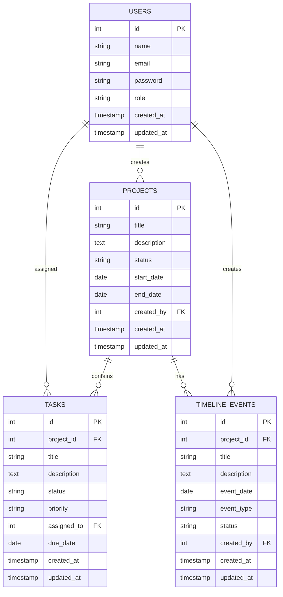

# Database Design Documentation

## Database Overview

The QTRI Management System uses PostgreSQL as its primary database, implementing a relational schema designed for scalability and performance.

## Entity Relationship Diagram



## Table Schemas

### Users Table
```sql
CREATE TABLE users (
    id SERIAL PRIMARY KEY,
    name VARCHAR(255) NOT NULL,
    email VARCHAR(255) UNIQUE NOT NULL,
    password VARCHAR(255) NOT NULL,
    role VARCHAR(50) NOT NULL,
    created_at TIMESTAMP WITH TIME ZONE DEFAULT CURRENT_TIMESTAMP,
    updated_at TIMESTAMP WITH TIME ZONE DEFAULT CURRENT_TIMESTAMP
);
```

#### Indexes
- Primary Key: `id`
- Unique Index: `email`
- Index: `role`

### Projects Table
```sql
CREATE TABLE projects (
    id SERIAL PRIMARY KEY,
    title VARCHAR(255) NOT NULL,
    description TEXT,
    status VARCHAR(50) NOT NULL,
    start_date DATE,
    end_date DATE,
    created_by INTEGER REFERENCES users(id),
    created_at TIMESTAMP WITH TIME ZONE DEFAULT CURRENT_TIMESTAMP,
    updated_at TIMESTAMP WITH TIME ZONE DEFAULT CURRENT_TIMESTAMP
);
```

#### Indexes
- Primary Key: `id`
- Index: `created_by`
- Index: `status`
- Index: `start_date, end_date`

### Tasks Table
```sql
CREATE TABLE tasks (
    id SERIAL PRIMARY KEY,
    project_id INTEGER REFERENCES projects(id),
    title VARCHAR(255) NOT NULL,
    description TEXT,
    status VARCHAR(50) NOT NULL,
    priority VARCHAR(20),
    assigned_to INTEGER REFERENCES users(id),
    due_date DATE,
    created_at TIMESTAMP WITH TIME ZONE DEFAULT CURRENT_TIMESTAMP,
    updated_at TIMESTAMP WITH TIME ZONE DEFAULT CURRENT_TIMESTAMP
);
```

#### Indexes
- Primary Key: `id`
- Index: `project_id`
- Index: `assigned_to`
- Index: `status`
- Index: `due_date`

### Timeline Events Table
```sql
CREATE TABLE timeline_events (
    id SERIAL PRIMARY KEY,
    project_id INTEGER REFERENCES projects(id) ON DELETE CASCADE,
    title VARCHAR(255) NOT NULL,
    description TEXT,
    event_date DATE NOT NULL,
    event_type VARCHAR(50) NOT NULL,
    status VARCHAR(50),
    created_by INTEGER REFERENCES users(id),
    created_at TIMESTAMP WITH TIME ZONE DEFAULT CURRENT_TIMESTAMP,
    updated_at TIMESTAMP WITH TIME ZONE DEFAULT CURRENT_TIMESTAMP
);
```

#### Indexes
- Primary Key: `id`
- Index: `project_id`
- Index: `event_date`
- Index: `event_type`

## Data Types

### Common Data Types Used
1. **SERIAL**: Auto-incrementing integer for IDs
2. **VARCHAR(n)**: Variable-length character strings
3. **TEXT**: Unlimited length text fields
4. **DATE**: Date without time
5. **TIMESTAMP WITH TIME ZONE**: Timestamp with timezone information

### Enumerated Types
```sql
-- Status Types
CREATE TYPE project_status AS ENUM (
    'planning',
    'in_progress',
    'completed',
    'on_hold',
    'cancelled'
);

-- Priority Types
CREATE TYPE task_priority AS ENUM (
    'low',
    'medium',
    'high',
    'urgent'
);

-- User Roles
CREATE TYPE user_role AS ENUM (
    'admin',
    'manager',
    'team_member',
    'viewer'
);
```

## Database Functions

### Timestamp Update Trigger
```sql
CREATE OR REPLACE FUNCTION update_timestamp()
RETURNS TRIGGER AS $$
BEGIN
    NEW.updated_at = CURRENT_TIMESTAMP;
    RETURN NEW;
END;
$$ language 'plpgsql';
```

### Triggers
```sql
-- Users Table
CREATE TRIGGER update_users_timestamp
    BEFORE UPDATE ON users
    FOR EACH ROW
    EXECUTE FUNCTION update_timestamp();

-- Projects Table
CREATE TRIGGER update_projects_timestamp
    BEFORE UPDATE ON projects
    FOR EACH ROW
    EXECUTE FUNCTION update_timestamp();

-- Tasks Table
CREATE TRIGGER update_tasks_timestamp
    BEFORE UPDATE ON tasks
    FOR EACH ROW
    EXECUTE FUNCTION update_timestamp();

-- Timeline Events Table
CREATE TRIGGER update_timeline_events_timestamp
    BEFORE UPDATE ON timeline_events
    FOR EACH ROW
    EXECUTE FUNCTION update_timestamp();
```

## Query Optimization

### Common Queries

1. **Get Project with Tasks and Timeline**
```sql
SELECT 
    p.*,
    json_agg(DISTINCT t.*) as tasks,
    json_agg(DISTINCT e.*) as events
FROM projects p
LEFT JOIN tasks t ON t.project_id = p.id
LEFT JOIN timeline_events e ON e.project_id = p.id
WHERE p.id = $1
GROUP BY p.id;
```

2. **Get User's Assigned Tasks**
```sql
SELECT 
    t.*,
    p.title as project_title
FROM tasks t
JOIN projects p ON p.id = t.project_id
WHERE t.assigned_to = $1
ORDER BY t.due_date ASC;
```

### Performance Tips

1. **Use Appropriate Indexes**
   - Create indexes for frequently queried columns
   - Consider composite indexes for common query patterns
   - Monitor index usage with pg_stat_user_indexes

2. **Query Optimization**
   - Use EXPLAIN ANALYZE for query planning
   - Implement pagination for large result sets
   - Use appropriate JOIN types (LEFT, INNER, etc.)

3. **Connection Management**
   - Implement connection pooling
   - Set appropriate pool sizes
   - Monitor connection usage

## Backup and Recovery

### Backup Strategy
1. **Daily Full Backups**
```bash
pg_dump -Fc dbname > backup.dump
```

2. **Continuous WAL Archiving**
```bash
archive_command = 'cp %p /archive/%f'
```

### Recovery Procedures
1. **Full Database Restore**
```bash
pg_restore -d dbname backup.dump
```

2. **Point-in-Time Recovery**
```bash
recovery_target_time = '2024-03-21 15:00:00'
```

## Maintenance

### Regular Maintenance Tasks
1. **VACUUM ANALYZE**
```sql
VACUUM ANALYZE;
```

2. **Reindex**
```sql
REINDEX TABLE table_name;
```

3. **Update Statistics**
```sql
ANALYZE table_name;
``` 