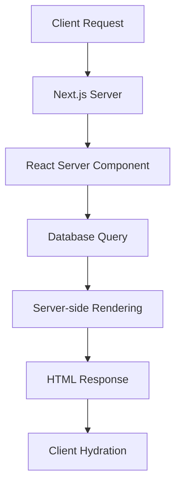
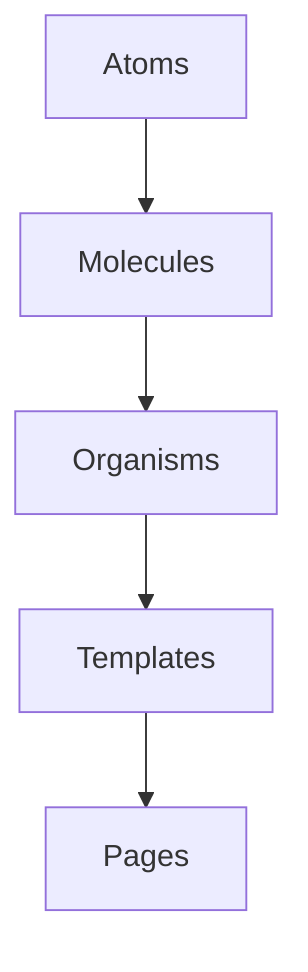
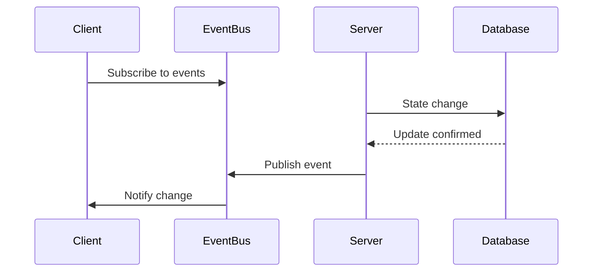
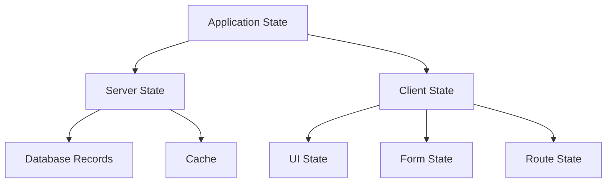
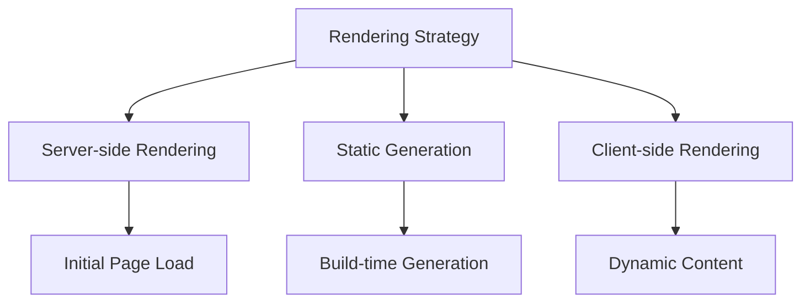
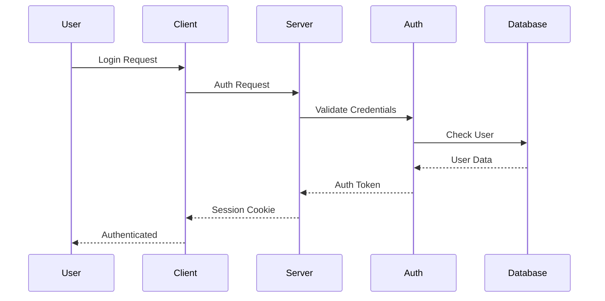
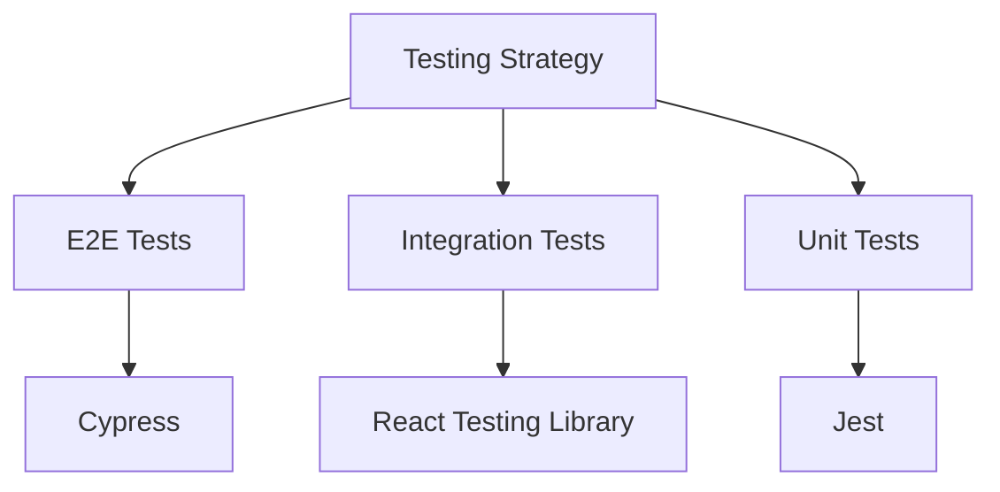

# Architectural Concepts and Theory

## Core Architectural Patterns

### 1. Server Components Architecture (React Server Components)

React Server Components (RSC) is a new paradigm that enables rendering React components on the server. This architecture provides several benefits:



#### Benefits
- Zero bundle size for server components
- Direct database access
- Improved initial page load
- Better SEO performance

#### Implementation
```typescript
// Server Component
async function ProjectList() {
  const projects = await db.query('SELECT * FROM projects');
  return (
    <ul>
      {projects.map(project => (
        <ProjectItem key={project.id} project={project} />
      ))}
    </ul>
  );
}
```

### 2. Atomic Design Pattern

The UI is built following the Atomic Design methodology:



#### Implementation Levels
1. **Atoms**: Basic UI elements
2. **Molecules**: Simple component combinations
3. **Organisms**: Complex UI sections
4. **Templates**: Page layouts
5. **Pages**: Complete views

### 3. Event-Driven Architecture

The system uses an event-driven approach for real-time updates and state management:



## Design Patterns

### 1. Repository Pattern

```typescript
// Repository Interface
interface IProjectRepository {
  findById(id: string): Promise<Project>;
  findAll(): Promise<Project[]>;
  create(project: Project): Promise<Project>;
  update(project: Project): Promise<Project>;
  delete(id: string): Promise<void>;
}

// Implementation
class PostgresProjectRepository implements IProjectRepository {
  async findById(id: string): Promise<Project> {
    // Implementation
  }
  // Other methods...
}
```

### 2. Factory Pattern

```typescript
// Component Factory
class ComponentFactory {
  static createButton(type: ButtonType): React.ComponentType {
    switch (type) {
      case 'primary':
        return PrimaryButton;
      case 'secondary':
        return SecondaryButton;
      default:
        return DefaultButton;
    }
  }
}
```

### 3. Observer Pattern

```typescript
// Event System
class EventEmitter {
  private listeners: Map<string, Function[]>;

  subscribe(event: string, callback: Function) {
    // Implementation
  }

  emit(event: string, data: any) {
    // Implementation
  }
}
```

## State Management Theory

### 1. Server State vs Client State



### 2. State Management Patterns

#### Server State
```typescript
// Server-side Data Fetching
async function getData() {
  const res = await fetch('api/data', {
    cache: 'no-store'
  });
  return res.json();
}
```

#### Client State
```typescript
// React Context
const StateContext = createContext<State>(initialState);

function StateProvider({ children }: PropsWithChildren) {
  const [state, dispatch] = useReducer(reducer, initialState);
  return (
    <StateContext.Provider value={{ state, dispatch }}>
      {children}
    </StateContext.Provider>
  );
}
```

## Performance Optimization Theory

### 1. Rendering Optimization



### 2. Caching Strategy

```typescript
// Route Segment Config
export const revalidate = 3600; // Revalidate every hour

// Dynamic Data Fetching
async function getData() {
  const res = await fetch('api/data', {
    next: {
      revalidate: 3600
    }
  });
  return res.json();
}
```

## Security Concepts

### 1. Authentication Flow



### 2. Authorization Patterns

```typescript
// Role-based Authorization
const withAuth = (WrappedComponent: React.ComponentType, allowedRoles: Role[]) => {
  return function AuthenticatedComponent(props: any) {
    const { user } = useAuth();
    
    if (!user || !allowedRoles.includes(user.role)) {
      return <AccessDenied />;
    }
    
    return <WrappedComponent {...props} />;
  };
};
```

## Testing Theory

### 1. Testing Pyramid



### 2. Test Patterns

```typescript
// Component Testing
describe('Component', () => {
  it('renders correctly', () => {
    const { getByText } = render(<Component />);
    expect(getByText('Hello')).toBeInTheDocument();
  });
  
  it('handles user interaction', async () => {
    const { getByRole } = render(<Component />);
    await userEvent.click(getByRole('button'));
    // Assertions
  });
});
```

## API Design Theory

### 1. RESTful Principles

```typescript
// API Route Handler
export async function GET(request: Request) {
  // Implementation
}

export async function POST(request: Request) {
  // Implementation
}
```

### 2. API Response Patterns

```typescript
// Response Structure
interface ApiResponse<T> {
  data: T;
  meta: {
    status: number;
    message: string;
  };
  pagination?: {
    page: number;
    limit: number;
    total: number;
  };
}
```

## Error Handling Theory

### 1. Error Boundaries

```typescript
class ErrorBoundary extends React.Component<Props, State> {
  static getDerivedStateFromError(error: Error) {
    return { hasError: true };
  }
  
  componentDidCatch(error: Error, errorInfo: React.ErrorInfo) {
    // Log error
  }
  
  render() {
    if (this.state.hasError) {
      return <ErrorFallback />;
    }
    return this.props.children;
  }
}
```

### 2. Error Handling Patterns

```typescript
// API Error Handling
async function fetchData() {
  try {
    const response = await fetch('/api/data');
    if (!response.ok) {
      throw new ApiError(response.statusText);
    }
    return await response.json();
  } catch (error) {
    handleError(error);
  }
}
``` 